# Premier League Analysis

## 1. Introduction

### 1.1 The challenges
The English Premier League is the oldest association football league in the world, established in
the late 19​th​ century, the competition has been taking place every year since 1888-1889.
According to wikipedia, "the English Premier League is the top-tier division in the English
football league system"<sup>1</sup>​. Each year there are twenty teams contesting the league, where all
teams face each other twice, and are ranked by the total points they accrue throughout the
season​<sup>2</sup>​.  

Beside winning the competition, the top 6 teams qualify to continental competitions the following
season (UEFA Champions League and UEFA Europa League), providing additional income
sources and more exposure, not to mention prestige.  

Finally, the bottom three teams are relegated to the second division, and are replaced by the top
3 teams from that division. The football business has seen immense growth in recent decades,
driven by increased coverage and spending, making the mere participation in the league a very
lucrative proposition, let alone winning it, something reflected in the yearly relegation battles.  

Accordingly, we can define these three challenges taking place as such:
1) Win the league → Rank = 1
2) Qualify for continental competitions → Rank > 7
3) Avoid relegation → Rank > 18  

Defining the challenges will give a glimpse into what is going on in the mind of a team's
leadership at the beginning of each new season, and how they develop plans for future
seasons.
Initially, our goal was to analyse each team and provide suggestions on what it needs to do to
achieve better results. However, after working on several ideas we found that it would take a lot
of time to analyse each team individually. At that point, It became apparent to us that a better
approach would be to develop a method that can help any team measure its performances and
identify weak areas that it can address in the future.

### 1.2 The dataset
Now, a quick work on the data. We will be using data from the understat​<sup>3</sup>​ website. The site
provides data for the 6 European leagues (English, Spanish, Italian, German, French, &
Russian), starting from the 2014/15 season. The site's data is accessible through the
understatr​<sup>4</sup>​ R package. It provides league, team, & player data. In our study we will only focus on team data, accessible through the get_league_teams_stats() function. Appendix 1 provides a
guide for the data collected using this function. We also decided to exclude the 2019/20 season.

## 2. The Path

### 2.1 The winning formula

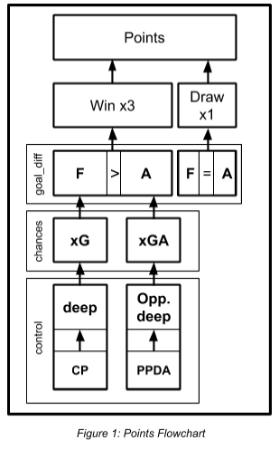 Having identified the challenges and 'what' is at
stake, we move to the next part; that is: 'how' a
team can accomplish its goals. As mentioned
earlier, teams are ranked by points total,
accordingly total points will be the deciding factor.
Figure 1 describes the progression of factors that
contribute to accumulating more points.  

Teams are awarded 3 points for winning a match,
1 for a draw, and 0 for a loss. Therefore, a team
wanting to challenge for the title needs to win most
of its matches, to draw as little as possible, and to
avoid losses. Winning a match is straightforward,
team A needs to score more goals than team B, in
other words, goals decide the winner. Not only
that, they are the most exciting part of the game,
associated with huge celebrations - sometimes
amounting to mass hysteria - among players and
fans. This begs a question, why is that? After all,
you don't see a basketball game stopping after
each scored bucket. To answer this question we
need to lock beyond the technical or tactical
aspects that are associated with a goal. Football is
unique among sports in its low-scoring nature,
something that gives goals an almost mystical
nature. So how do we measure goals, or better yet, how do we predict them? Using the past to
predict the future is usually a good place to start. We can predict how many many goals a team
might score in the next match using the number of goals it has scored in the previous match.
However, this method does not account for important factors, such as the situation from which a
goal was scored (open-play or a set-piece), the distance between the point where the ball was
struck from to the goal line, whether the ball was shot by the leg (which leg?) or headed. This is
where the expected goals​<sup>5</sup>​ statistic (xG) comes in. It describes the quality of a chance by
accounting for the aforementioned factors.  

This raises another question, how does a team increase its xG? The answer is simple, by
keeping the ball, or more specifically, by keeping it close to your opponent's goal. This is exactly
what the 'deep' and 'completed passes' (CP) statistics tell us; CP is the total number of passes a team successfully completes during a match, while deep is the number of passes completed
within 20 yards from the opponents' goal.  

Now that we have defined what a team needs to do to score more goals, we look at the other
side of the equation, avoiding conceding them. Much like with scoring goals, xGA describes the
quality of the chances a team concedes. Teams need to keep this number low. Also, if your
opponent has the ball near to your goal, they are more likely to score, so your team needs to
keep the 'deep_allowed' statistic low. Finally, there is the 'passes per defensive action' statistic
(PPDA)​<sup>6</sup>​, which explains how many passes your opponent completes without contention; a high
value for this statistic means that the opponent is having more success when in possession of
the ball.  

In conclusion, we can say that for a team to amass as many points as it can it needs to do the
following: control the game by keeping the ball more than its opponent. It can do so by
completing more accurate passing (CP), preferably nearer to its opponent goal (deep). This will
open the door to creating more chances to score (xG), increasing the probability of scoring
goals and winning games. Simultaneously, it needs to limit the opponents' possession by trying
to win the ball back as fast as possible (PPDA), and as far from its goal as possible
(deep_allowed). Failing to do so will result in the opponent creating better chances (xGA), which
it could turn into goals against, thus limiting its chances of winning.

### 2.2 Points and other important factors

To develop this flowchart, we used our intuitive understanding of the game, assisted by the data
collected from understat. To download the data you need to call the `get_league_teams_stats()`
function, which takes both a league_name and year as parameters. A call might look something
like this:

  

This call will extract statistics for all matches played during the 2014/15 English Premier League
season. The output is a tible object, with 25 columns describing different features of the match,
and 760 rows for all matches played throughout the season (20 teams * 38 matches per team).
It looks like this:

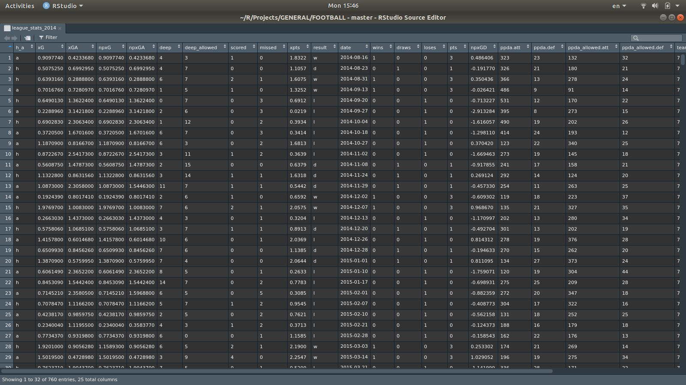  

Our analysis centers around total points, being the deciding criteria for the various challenges.
Therefore, we had to transform this table into an overall ranking, and sum the total points
accumulated by each team. We achieved this by creating the get_season() function, which uses
groupby team to calculate and aggregate sum of all statistics:

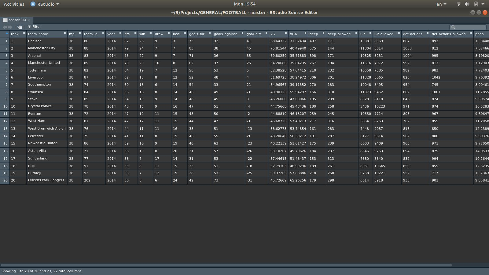  

A quick note here, we excluded a few features (such as `h_a` which tells whether a match was
played at home or away). We also used the data itself to create a few important features like
PPDA, which does not come as a standalone statistic, but can be calculated using its constituents:

$$PPDA = {Passes\ Completed\ By\ Opponent \over Defensive\ Actions} $$

We constructed a season table for the years 2014 through 2019, and combined them all
together in the season_all object.
We then started analysing the season_all object, by looking at relationships between different
features. These relationships are explored below.

#### 2.2.1 Scatter plots

The first visualization is a combined scatter plot showing the kind of relationship between points
and the other predictors:

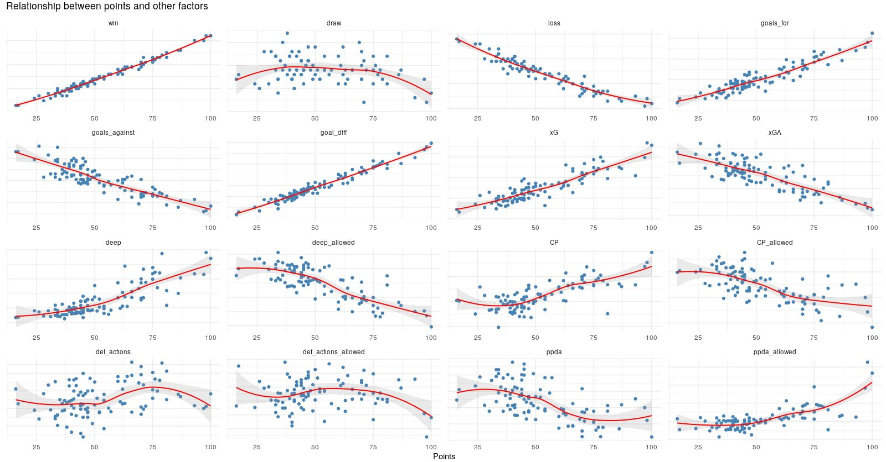  

The scatter plots above tell us that most of these relationships are linear in nature, especially so
with when it comes to wins and goals. Other relationships are more complex, that is to say, the
road from wins/goals to points is straightforward, however, the road to wins/goals is more
complex.

#### 2.2.2 Correlation Matrix

Now lets see which features correlate together. By using the `ggcorrplot()` function, we were able
to use hierarchical clustering​<sup>7</sup>​ to order the matrix' columns. As you can see, features describing
factors contributing to conceding goals [avgCP_allowed, ppda, loss, goals_against, xGA, deep_allowed] are grouped together, while features describing factors contributing to scoring
goals [avgCP, ppda_allowed, deep, pts, win, goals_for, xG] are grouped separately:

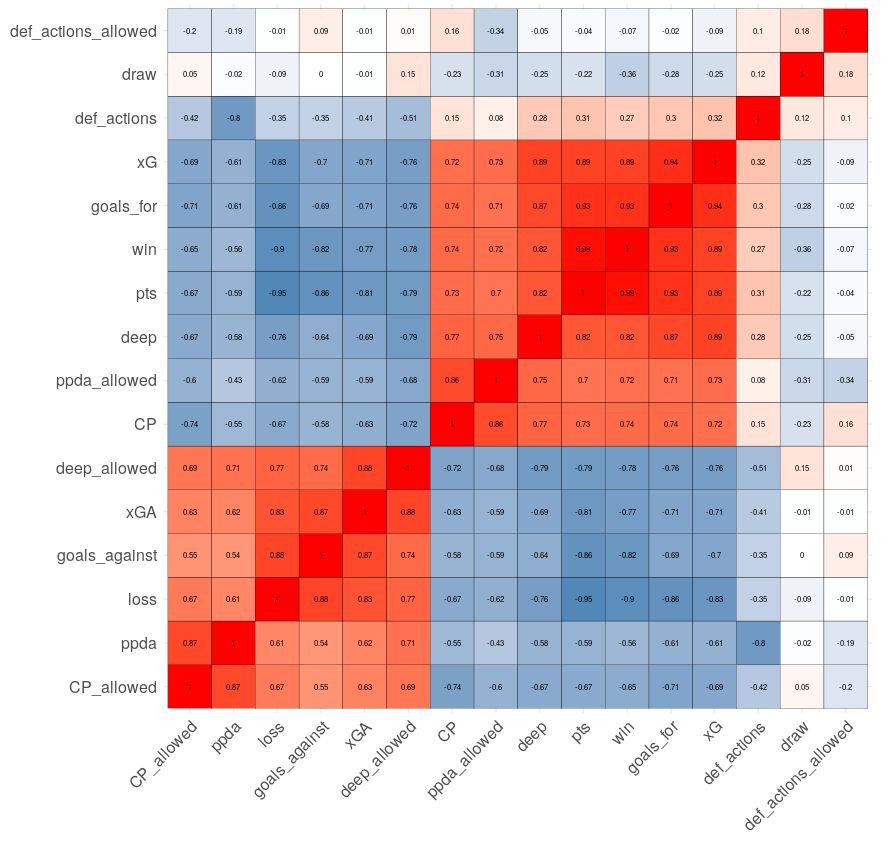  

Below, we highlight some correlation coefficients, in a cascading manner, i.e. we only include
features that were not already examined to avoid redundancy:

- 'pts' correlate the most with 'win', with a correlation coefficient of 0.99
- 'win' correlate the most with 'goal_for', with a correlation coefficient of 0.93
- 'goal_for' correlate the most with 'xG', with a correlation coefficient of 0.94
- 'xG' correlate the most with 'deep', with a correlation coefficient of 0.89
- 'deep' correlate the most with 'avg_CP', with a correlation coefficient of 0.77
- 'goals_against' correlate the most with 'xGA', with a correlation coefficient of 0.87
- 'xGA' correlate the most with 'deep_allowed', with a correlation coefficient of 0.88-
- 'deep_allowed' correlate the most with 'ppda', with a correlation coefficient of 0.71

The first 2 visuals oriented our focus, and provided the first glimpses into the flowchart. The next
thing we look at is the relationship between xG and goals.

#### 2.2.3 The case for xG

Goal Lines
Here we highlight differences between xG and goals_scored. The first chart we look at is a line
chart showing the rolling average for xG vs. the rolling average goal scored:

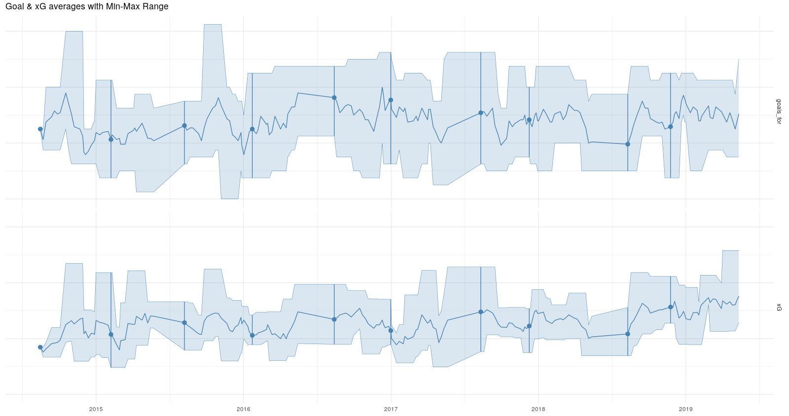  

The average goal scored line has more variance than xG, making it noisier, which can ultimately
affect its predictive power. The process we used to plot these lines is illustrated below:
1. This is a time series, so we will use the original data which has a date column, instead of the
the aggregated season ending table we created for the scatterplot and correlation matrix
2. Next, we calculate 3 aggregated values, all over a 6 match period. The aggregated values
are the average, min, max for goals and xG, using the roll_mean(), roll_min(), roll_max()
functions
3. This point is associated with the point before. Since we are aggregating over a 6-match
period, the first 5 matches will have null aggregate values. We fill those.
4. After that, we gather the resulting dataframe, and plot the lines above

**Separate Models**

Next, we build and compare two linear regression models, the first using the xG of the previous
match to predict how many goals will be scored in the following match, while the second model
uses the goals scored in the previous match. Below we show R-squared values of both values:

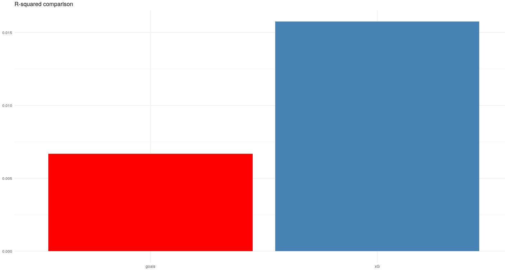  

The process we used to create these models and make this plot is illustrated below:  
1. Just like with the previous plot, we use the original data source
2. We collect the team name, match date and goals scored in each match
3. Then, for every observation we add 2 columns: the goals scored and the xG of the previous
match. We make sure that these values are team relevant, we do this step on a per-team basis
4. Now that we have the data, we use the lm() method to build 2 linear regression models one
using the xG as a predictor the other using goals  

We can see that the r-squared value of the xG model is more than double that of the goals
model. (Note: these are very simple models, with no predictive power, we just want to illustrate
the difference between the predictive power of xG and goals).

**Combined Model**

We also built a linear regression model using both xG and goals_scored, and it turns out that
only xG is statistically significant as indicated by the p-values shown in the below table:

|          | Coefficient   | Std. Error | t-value | p-value |
|--------------|-----------|------------|------------|------------|
| (Intercept) | 1.109689      | 0.037486        |29.603|< 2e-16 ***|
| xG of previous match      | 0.185639  | 0.031379   |5.916|3.59e-09 ***|
| Goals scored in previous match| 0.003125  | 0.020890 |0.150|0.881|  

This could be a further indication on why xG might be a better predictor than goals_scored, but
the model is too simple to actually be certain.

## 3. Benchmarks 

A quick recap of what we have done so far: First, we identified the challenges within a given
premier league season. Second, we identify the factors involved in achieving those challenges,
and explore the relationships between them. The next step is building a benchmark that acts as
a standard for each challenge.
In the following segment, we take a holistic view at the teams that have competed in the
Premier League from 2014 to 2019, and create a 'platonic table' that shows the averages for all
features over the 5 year period. This way, teams will have an idea of what they need to do to
accomplish a certain challenge.

## 3.1 Platonic Table

We create the platonic table described above, call it platonicbale. It looks something like this:

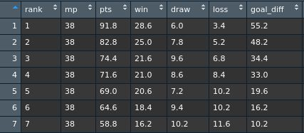 

To better understand this table, consider the first row, describing what it looks like to be a
champion. Over the 5 year period considered in our study, the average number of points
needed to win the title is 91.8 points, accumulated from 28.6 wins, 6.0 draws, 3.4 loss, and a
goal difference of 55.2. Now we visually explore the various features.
To create this table we take the season_all object (created in section 2.2), and aggregate by
rank instead of team name.

**Points​<sup>8</sup>**  

The first visual is a lollipop bar chart showing the average points for each ranking:

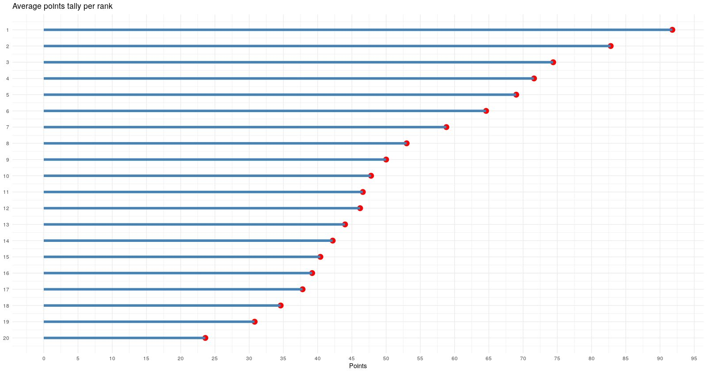 

By looking at this visual, we can identify several separations:
1. Between teams ranked 1 & 2, with a 9 point different between them
2. Between teams ranked 1-2, and the rest of the pack, with an 8 point difference between 2<sup>​nd</sup> and 3​<sup>rd</sup>
3. Teams ranked 3-6 are grouped together, with an average separation of 3.2 points
4. Teams ranked 8-16 are grouped together, with an average separation of 1.68 points
We used geom_point and geom_segment to construct this visual. The data was used as-is

**Win/lose/draw percentage​<sup>9</sup>**  

The second visual is a group pie chart showing the win-lose-draw percentages for each rank:

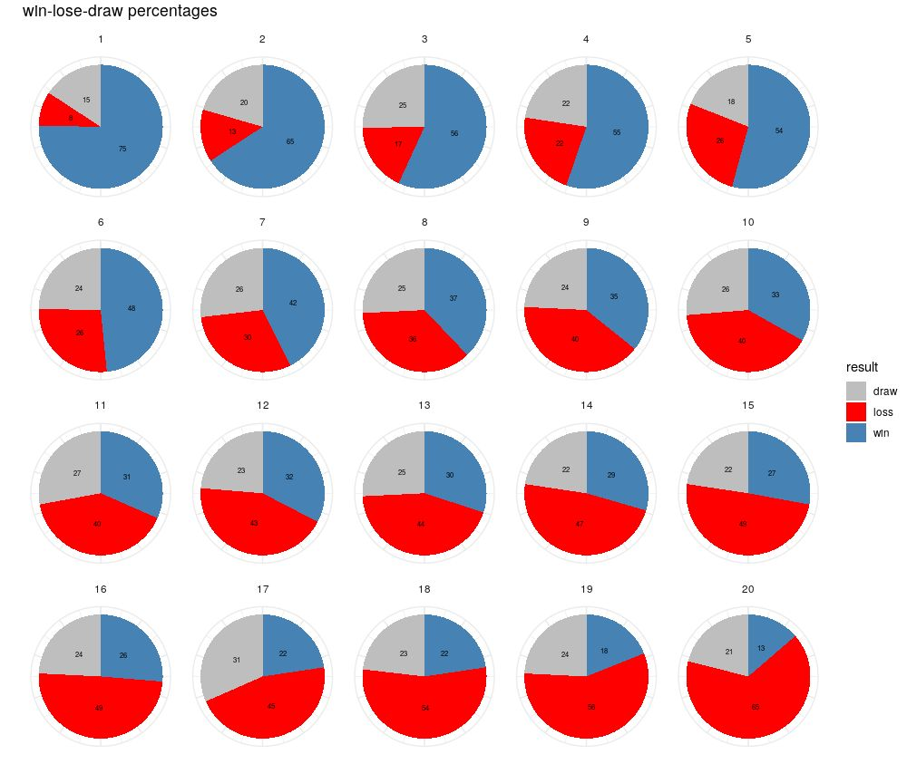

Just like the previous visual, we can identify several separations here. These are similar to the
previous so there is no point of listing them again. This visual quickly identifies the win
percentage a team needs to achieve a certain goal (ex. 75% win-percentage to win the league).

**Goal difference**  

Visual number 3 is the a spread of the goals:

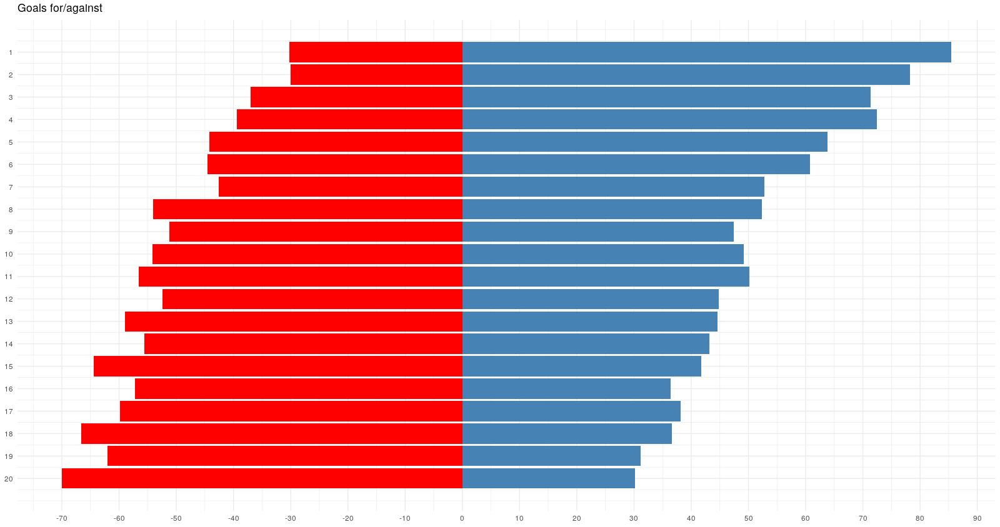  

The main takeaway from this plot is the fact that offense is key. You can identify this fact by
looking at the top 2 teams, while they concede the same amount of goals, the top ranked team
scores 7 more goals on average.
We used `geom_col()` to produce this plot.

**Goals and xG**  

In the 4th visual we return to goals and expected goals, analysing the relationship between
them:

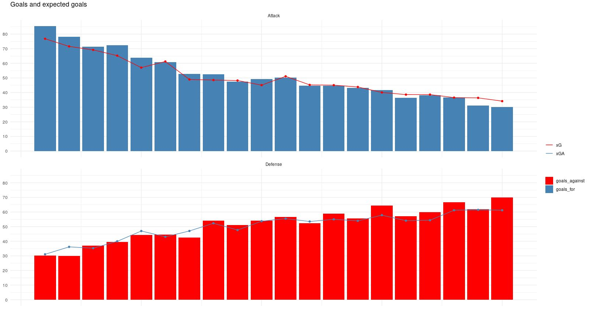  

Both on the offensive and the defensive side, teams outscoring their expected goals values
usually fare better. This could be an indication of the role of luck in sports.
To construct this visual we had to make several transformations on the platonicbale. First we
gather on the four plotted stats (goals_for, goals_against, xG, xGA), then we filter on rows that
have either goals_for & xG, or goals_against & xGA only. The bars are created using
geom_bar, the lines using geom_line, and facet_col for the separation.

**Attitude and work**  

The final visualization combines together several features. Specifically, deep passes, completed
passes, xG and PPDA. The idea here was to capture the attitude and workrate of teams and
combine those two factors with chance quality (xG). By attitude we mean how active a team is
during possession, we explain this by Active Possession

$$Active Possession = {Deep\ Passes \over Completed\ Passes}$$

It is the ratio of deep passes to completed passes. It measures how active a team is when in
possession of the ball. This value is plotted on the x-axis. Note: this value was calculated
exclusively for this visualization.  

Workrate is captured by PPDA. A team allowing less passes per defensive action is a team that
tries to retrieve the ball as fast as possible. PPDA was constructed earlier, using the following
equation:  

$$Passes\ Per\ Defensive\ Action = {Opponent\ Completed\ Passes \over Defensive\ Actions}$$

This value is plotted on the y-axis. We use an inverted axis here.

Finally, the circle area and color gradient represent the xG value. The bigger & bluer the higher
the xG:

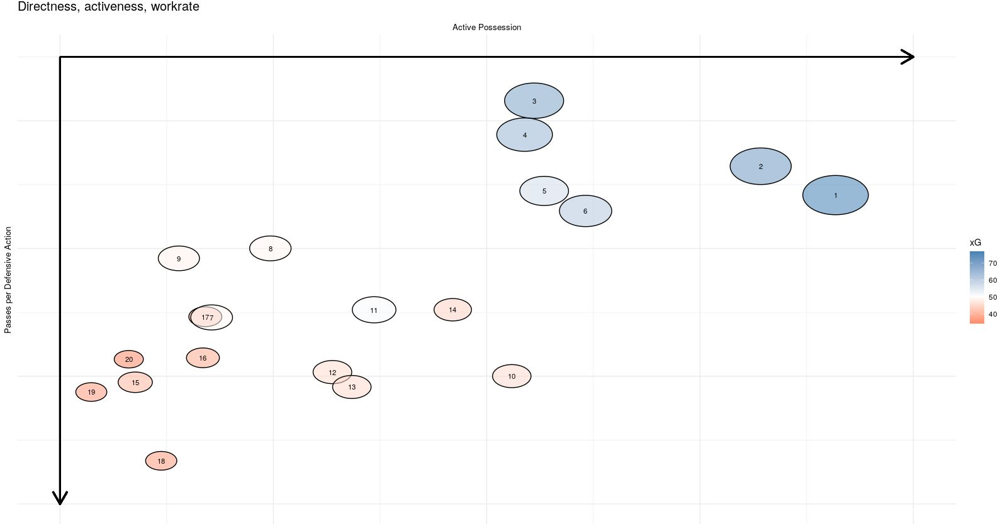

Teams with higher active possession (to the right), and less PPDA (upper), tend to have better
xG values.

## 4. ​Champions, challengers, and also-rans

### 4.1 Pedigree​<sup>10</sup>  

After describing the challenges, framework, and benchmarks, we now move on to looking at
actual teams. The first thing any team should do is to set itself a challenge at the start of the
season. Not all teams are meant to challenge for the title, in fact only 31.25% of the teams that
ever played in the English top division have won a championship, however, out of the 120
league titles, 50% were won by 4 teams

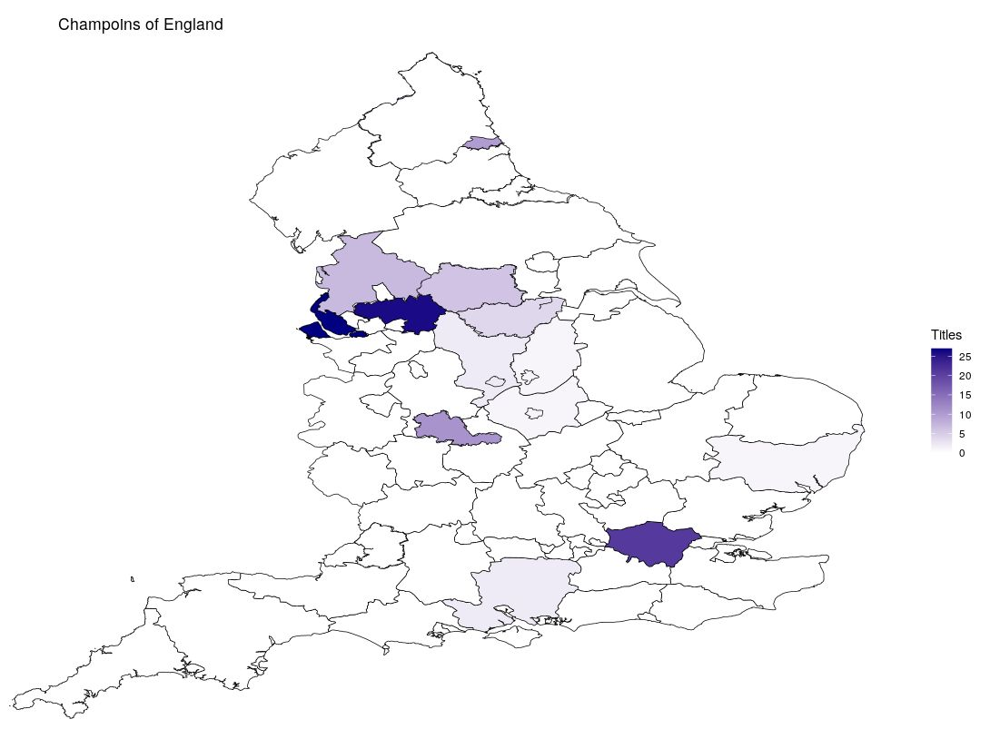

This visual reiterates the fact that not all teams have the capabilities and the wherewithal to
challenge for the titles.
The above is a county map of England. It was created using two separate maps imposed over
each other.

### 4.2 Race to the top​<sup>11</sup>

The following visual looks at the progress of all teams throughout the 5 year period of our study:


This is a good way to look at identify major events, like a takeover or a managerial change.

### 4.3 Challenge 1: Win the league​<sup>12</sup>

We look at the 5 winners (seasons 2015, 16, 17, 18 & 19). We average their numbers, and use
that average as a benchmark for comparison. This will help us identify areas where each
champion was better/worse than average Radar charts are a great way to quickly identify weak
areas that need improvement:

**Anatomy of a champoin**  

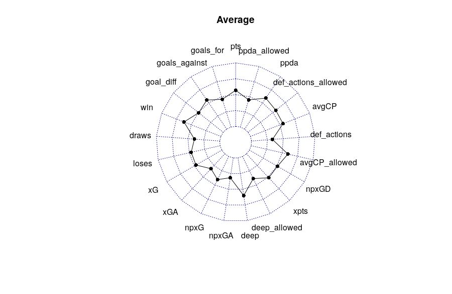

spider-2.png
spider-3.png
spider-4.png
spider-5.png
spider-6.png

## APPENDIX-1
This appendix provides a definition for all the features collected by the get_league_teams_stats
function:

| Column Name        | Type      | Description                                                                                              |
|--------------------|-----------|----------------------------------------------------------------------------------------------------------|
| ha                 | categorical | home/away                                                                                                |
| xG                 | numerical  | expected goals for                                                                                       |
| xGA                | numerical  | expected goals against                                                                                   |
| npxG               | numerical  | expected goals for without penalties and own goals                                                      |
| npxGA              | numerical  | expected goals against without penalties and own goals                                                  |
| deep               | numerical  | passes completed within an estimated 20 years of goal (crosses excluded)                                 |
| deep_allowed       | numerical  | opponent passes completed within an estimated 20 years of goal (crosses excluded)                         |
| scored             | numerical  | goals scored                                                                                             |
| missed             | numerical  | goals allowed                                                                                            |
| xpts               | numerical  | expected points                                                                                          |
| result             | categorical | win/lose/draw                                                                                            |
| date               | date       | date                                                                                                     |
| wins               | binary     | win/no win                                                                                               |
| draws              | binary     | draw/no draw                                                                                             |
| loses              | binary     | loss/no loss                                                                                             |
| pts                | categorical | 3/1/0                                                                                                    |
| npxGD              | numerical  | the difference between "for" and "against" expected goals without penalties and own goals               |
| ppda.att           | numerical  | passes allowed in the opposition half                                                                    |
| ppda.def           | numerical  | defensive actions in the opposition half                                                                 |
| ppda_allowed.att   | numerical  | opponent passes allowed in the opposition half                                                           |
| ppda_allowed.def   | numerical  | opponent defensive actions in the opposition half                                                        |
| team_id            | categorical | 1:20                                                                                                     |
| team_name          | categorical | team name                                                                                                |
| league_name        | char       | league name                                                                                              |
| year               | date       | year                                                                                                     |

## APPENDIX-2
This appendix provides a list of the excluded and constructed features in the `get_season()`
function.

Excluded features:

- `h_a` (home/away): We're taking into account a whole picture. A separate analysis could be done for home & away performances.
- `result`: Redundant, replaced by `wins`, `losses`, and `draws` columns.
- `date`: We're only considering season ending rank, so we don't need it.
- `team_id`: We're using `team_name` as an identifier, so we don't need it.
- `league_name`: Implicit knowledge.
- `year`: See date.
- `season`: See date.
- `npxG` (non-penalty expected goals): For simplification, and the assumption that `xG` will be a better representation for the overall team activity - attacking teams are expected to win penalties and take advantage of own-goals by virtue of occupying opponents defensive space, however, could be included in player analysis to remove noise - for a clearer picture of what a player is capable of.
- `npxGA` (non-penalty expected goals against): See `npxG`.
- `xpts` (expected points): For simplification.
- `npxGD` (non-penalty expected goal difference): See `npxG`.

Constructed features:

- `goal_diff`: Total goals for - total goals against.
- `ppda`: `ppda.att` / `ppda.def`.
- `ppda_allowed`: `ppda_allowed.att` / `ppda_allowed.def`.

### APPENDIX-3
This appendix lists all the libraries that need to be installed for the code to run successfully:
```
# loading libraries
install.packages('remotes')
remotes::install_github('ewenme/understatr')
library(understatr) # > main
library(tidyverse) # > main2
library(fmsb) # > for radar chart
library(moments) # ???
library(reshape2) # > scatterplot
library(effectsize) # > for racing lines gif
library(gganimate) # > for racing lines gif
library(gifski) # > for racing lines gif
library(transformr) # > for racing lines gif
library(scales) # ???
library(ggrepel) # ???
library(ggcorrplot) # > for correlation plot
library(RcppRoll) # > line plot
library(ggforce) # > goals xG
library(maps) # > geovisualization
library(mapdata) # > geovisualization
library(maptools) # > geovisualization
library(rgdal) # > geovisualization
library(ggmap) # > geovisualization
library(rgeos) # > geovisualization
library(broom) # > geovisualization
library(geosphere) # > geovisualization
library(sp) # > geovisualization
library(gpclib)
library(sf)
```

The code for installating the understatr package is provided here. The other libraries could be
easily installed using the `install.packages()` command.

**Sources**  
Here are the sources provided in markdown format:

1. [Premier League - Wikipedia](https://en.wikipedia.org/wiki/Premier_League)
2. [Premier League Competition Format - Wikipedia](https://en.wikipedia.org/wiki/Premier_League#Competition_format)
3. [Understat](https://understat.com/)
4. [Understatr on GitHub](https://github.com/ewenme/understatr)
5. [Football Statistics: Expected Goals - Michael Caley](https://cartilagefreecaptain.sbnation.com/2015/4/10/8381071/football-statistics-expected-goals-michael-caley-deadspin)
6. [Defensive Metrics: Measuring the Intensity of a High Press - StatsBomb](https://statsbomb.com/2014/07/defensive-metrics-measuring-the-intensity-of-a-high-press/)
7. [Hierarchical Clustering - Wikipedia](https://en.wikipedia.org/wiki/Hierarchical_clustering)
8. 
    - a. [ggplot2 - Rotate a Graph, Reverse and Flip the Plot](http://www.sthda.com/english/wiki/ggplot2-rotate-a-graph-reverse-and-flip-the-plot)
    - b. [ggplot2 - Axis Ticks: A Guide to Customize Tick Marks and Labels](http://www.sthda.com/english/wiki/ggplot2-axis-ticks-a-guide-to-customize-tick-marks-and-labels)
9. 
    - a. [R: Changing Color of Stacked Barplot - Stack Overflow](https://stackoverflow.com/questions/43721603/r-changing-color-of-stacked-barplot)
    - b. [Remove All of X-Axis Labels in ggplot - Stack Overflow](https://stackoverflow.com/questions/35090883/remove-all-of-x-axis-labels-in-ggplot)
    - c. [How to Create a Pie Chart in R using ggplot2 - DataNovia](https://www.datanovia.com/en/blog/how-to-create-a-pie-chart-in-r-using-ggplot2/)
10. 
    - a. [Football League: 125 Years - The Guardian](https://www.theguardian.com/football/datablog/2013/apr/17/football-league-125-years)
    - b. [List of English Football Champions: Total Titles Won - Wikipedia](https://en.wikipedia.org/wiki/List_of_English_football_champions#Total_titles_won)
    - c. [Metropolitan and Non-metropolitan Counties of England - Wikipedia](https://en.wikipedia.org/wiki/Metropolitan_and_non-metropolitan_counties_of_England)
    - d. [UK Government's Geoportal](https://geoportal.statistics.gov.uk/)
    - e. [GADM - Download Country Shapefiles](https://gadm.org/download_country_v3.html)
    - f. [Filter Shapefile Polygons by Area - Stack Overflow](https://stackoverflow.com/questions/47078123/filter-shapefile-polygons-by-area)
    - g. [Merge Two Shapefiles in R - GIS Stack Exchange](https://gis.stackexchange.com/questions/264250/merge-two-shapefiles-in-r#264325)
    - h. [UK Pubs Data Visualization - RPubs](https://rpubs.com/mbacou/ukPubs)
    - i. [UK D3.js Map Example](http://bl.ocks.org/prabhasp/raw/5030005/)
    - j. [Creating Maps in R - Data Tricks](https://datatricks.co.uk/creating-maps-in-r)
    - k. [Data Visualization: Maps - Klein UK](https://klein.uk/teaching/viz/datavis-maps/)
11. [Outbreak Animation - GitHub](https://github.com/lukebornn/outbreak_animation)
12. [Spider Chart with Several Individuals - R Graph Gallery](https://www.r-graph-gallery.com/143-spider-chart-with-saveral-individuals.html)

Other sources:

- [Expected Goals Explained - Pinnacle](https://www.pinnacle.com/en/betting-articles/Soccer/expected-goals-explained/B8Q2HGJ7XMJRZ58C)
- [geom_circle Documentation - R Documentation](https://rdrr.io/cran/geomnet/man/geom_circle.html)